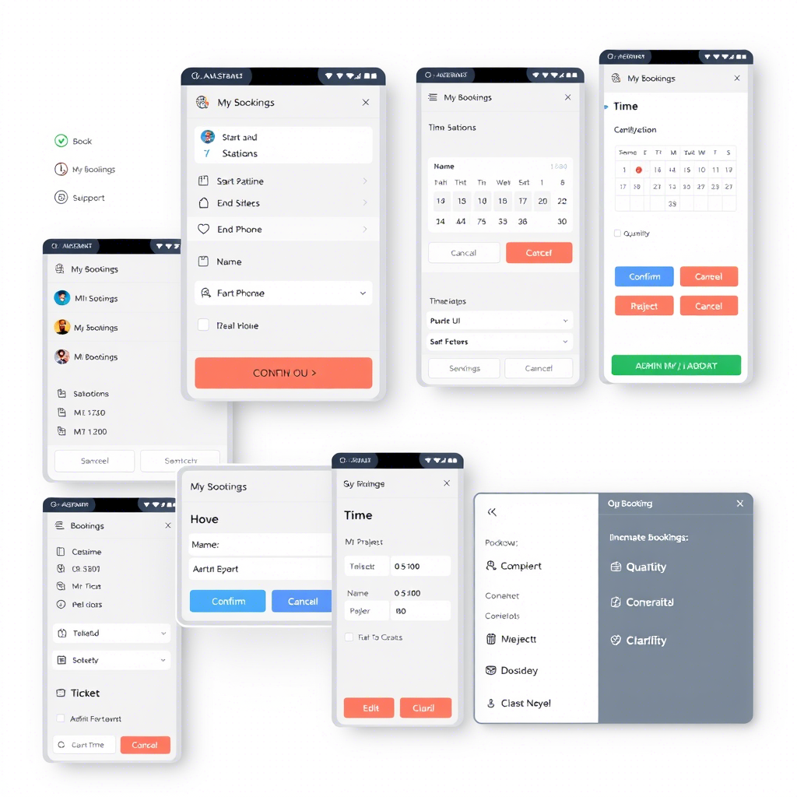

# Telegram Mini App для бронирования автобусных билетов

Веб-приложение для бронирования автобусных билетов, оптимизированное для работы в качестве Telegram Mini App.



## Особенности

- Интеграция с Telegram Web App API
- Использование нативных элементов интерфейса Telegram
- Пошаговый мастер бронирования с 6 этапами
- Тактильная обратная связь
- Темная и светлая тема
- Автоматическое заполнение данных пользователя из Telegram

## Технологии

- React 18
- TypeScript
- Vite
- Framer Motion для анимаций
- Tailwind CSS для стилизации
- date-fns для работы с датами

## Установка и запуск

```bash
# Установка зависимостей
bun install

# Запуск в режиме разработки
bun run dev

# Сборка для продакшн
bun run build
```

## Структура проекта

- `/src/components/booking` - Компоненты мастера бронирования
- `/src/components/ui` - UI-компоненты (Window, ThemeToggle)
- `/src/hooks/useTelegram.ts` - Хук для работы с Telegram Web App API
- `/src/types/telegram.ts` - Типы для работы с Telegram Web App API

## Интеграция с Telegram

Проект использует Telegram Web App API для:
- Получения данных пользователя
- Использования нативных кнопок
- Отправки данных в родительское приложение Telegram
- Использования темы Telegram
- Предоставления тактильной обратной связи

## Deployment

Приложение развернуто на Netlify: [https://same-05h6rvhg6iq-latest.netlify.app](https://same-05h6rvhg6iq-latest.netlify.app)

## Лицензия

MIT
